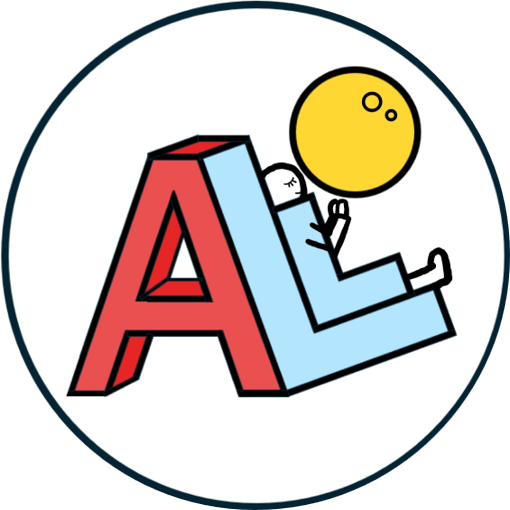

# ALLO

자취생을 위한 유일무이 종합 플랫폼

## Git Flow
+ 개발할 때 feature/[이름] 브랜치를 생성한다.
+ 자신의 브랜치에 push하고 develop 브랜치에 Pull Request를 보낸다.
+  다른 팀원이 코드 리뷰 후 merge한다.

### 팀원
| 김하정 | 윤나경 | 전해성 |
| --- | --- | --- |
| [@haerangssa](https://github.com/haerangssa) | [@nakyeongg](https://github.com/nakyeongg) | [@suncastle023](https://github.com/suncastle023) |
| 백엔드/데이터 | 프론트엔드 | 백엔드/AI |

## 실행 방법
git clone
```
git clone https://github.com/TEAM-ALLO/ALLO.git
```
디렉토리 이동
```
cd ALLO
```
가상환경 설치
```
python -m venv venv
```
가상환경 실행
```
source venv/Scripts/activate
```
필요한 라이브러리 설치
```
pip install -r requirements.txt
```
.env 파일 생성 (발급받은 key값을 추가)
```
cp .env.example .env
```
마이그레이션
```
python manage.py makemigrations
python manage.py migrate
```
런서버 실행
```
python manage.py runserver
```
